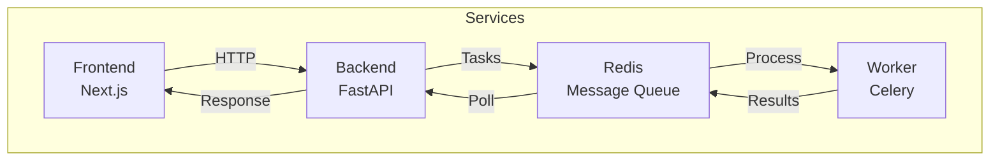

# Little Dragon

A modern web application with a microservices architecture, built using FastAPI, Next.js, and Celery.

## Architecture



### Components

- **Frontend**: Next.js application running on port 3001
- **Backend**: FastAPI application running on port 8005
- **Worker**: Celery worker for processing background tasks
- **Redis**: Message queue and result backend for Celery

## Prerequisites

- Docker
- Docker Compose
- Node.js (for local frontend development)
- Python 3.11 (for local backend development)

## Getting Started

1. Clone the repository:
   ```bash
   git clone <repository-url>
   cd little_dragon
   ```

2. Start all services:
   ```bash
   docker-compose up --build
   ```

3. Access the applications:
   - Frontend: http://localhost:3001
   - Backend API: http://localhost:8005
   - Redis: localhost:6379

## Development

### Frontend Development

```bash
cd frontend
npm install
npm run dev
```

### Backend Development

```bash
cd backend
python -m venv venv
source venv/bin/activate  # or `venv\Scripts\activate` on Windows
pip install -r requirements.txt
uvicorn main:app --reload --port 8005
```

### Worker Development

```bash
cd worker
python -m venv venv
source venv/bin/activate  # or `venv\Scripts\activate` on Windows
pip install -r requirements.txt
celery -A app.celery_app worker --loglevel=INFO
```

## Environment Variables

### Backend
- `ENVIRONMENT`: Development/Production environment
- `REDIS_URL`: Redis connection URL
- `CELERY_BROKER_URL`: Celery broker URL
- `CELERY_RESULT_BACKEND`: Celery result backend URL

### Frontend
- `NEXT_PUBLIC_API_URL`: Backend API URL
- `PORT`: Frontend port (default: 3001)
- `NODE_ENV`: Node environment

### Worker
- `REDIS_URL`: Redis connection URL
- `CELERY_BROKER_URL`: Celery broker URL
- `CELERY_RESULT_BACKEND`: Celery result backend URL
- `LOG_LEVEL`: Logging level (default: INFO)

## Docker Services

- **frontend**: Next.js application
- **backend**: FastAPI application
- **worker**: Celery worker
- `redis`: Redis server for message queue

## Contributing

1. Fork the repository
2. Create your feature branch (`git checkout -b feature/amazing-feature`)
3. Commit your changes (`git commit -m 'Add some amazing feature'`)
4. Push to the branch (`git push origin feature/amazing-feature`)
5. Open a Pull Request

## License

This project is licensed under the MIT License - see the [LICENSE](LICENSE) file for details. 