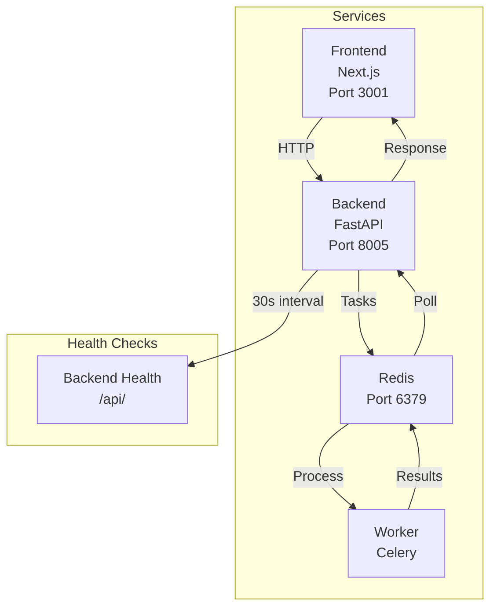

# Little Dragon

A modern web application with a microservices architecture, built using FastAPI, Next.js, and Celery.

## Architecture



### Components

- **Frontend**: Next.js application running on port 3001
  - Hot reload enabled for development
  - Volume mounted for live code updates
  - Next.js cache persisted in Docker volume

- **Backend**: FastAPI application running on port 8005
  - Health check endpoint at /api/
  - Automatic reload in development mode
  - Volume mounted for live code updates

- **Worker**: Celery worker for processing background tasks
  - Configured with JSON serialization
  - Task time limit: 1800 seconds
  - Max tasks per child: 100
  - Prefetch multiplier: 1

- **Redis**: Message queue and result backend for Celery
  - Redis 7 Alpine image
  - Persistent connection for message queue
  - Used for both broker and result backend

## Prerequisites

- Docker
- Docker Compose
- Node.js (for local frontend development)
- Python 3.13 (for local backend development)

## Getting Started

1. Clone the repository:
   ```bash
   git clone <repository-url>
   cd little_dragon
   ```

2. Start all services:
   ```bash
   docker-compose up --build
   ```

3. Access the applications:
   - Frontend: http://localhost:3001
   - Backend API: http://localhost:8005
   - Redis: localhost:6379

## Development

### Frontend Development

```bash
cd frontend
npm install
npm run dev
```

### Backend Development

```bash
cd backend
python -m venv venv
source venv/bin/activate  # or `venv\Scripts\activate` on Windows
pip install -r requirements.txt
uvicorn main:app --reload --port 8005
```

### Worker Development

```bash
cd worker
python -m venv venv
source venv/bin/activate  # or `venv\Scripts\activate` on Windows
pip install -r requirements.txt
celery -A app.celery_app worker --loglevel=INFO
```

## Environment Variables

### Backend
- `ENVIRONMENT`: Development/Production environment
- `REDIS_URL`: Redis connection URL (default: redis://redis:6379/0)
- `CELERY_BROKER_URL`: Celery broker URL (default: redis://redis:6379/0)
- `CELERY_RESULT_BACKEND`: Celery result backend URL (default: redis://redis:6379/0)

### Frontend
- `NEXT_PUBLIC_API_URL`: Backend API URL (default: http://backend:8005)
- `PORT`: Frontend port (default: 3001)
- `NODE_ENV`: Node environment (development/production)

### Worker
- `REDIS_URL`: Redis connection URL (default: redis://redis:6379/0)
- `REDIS_DB`: Redis database number (default: 0)
- `CELERY_BROKER_URL`: Celery broker URL (default: redis://redis:6379/0)
- `CELERY_RESULT_BACKEND`: Celery result backend URL (default: redis://redis:6379/0)
- `CELERY_TASK_SERIALIZER`: Task serialization format (default: json)
- `CELERY_RESULT_SERIALIZER`: Result serialization format (default: json)
- `CELERY_ACCEPT_CONTENT`: Accepted content types (default: json)
- `CELERY_TIMEZONE`: Timezone setting (default: UTC)
- `CELERY_ENABLE_UTC`: Enable UTC (default: True)
- `CELERY_TASK_TRACK_STARTED`: Track task start times (default: True)
- `CELERY_TASK_TIME_LIMIT`: Maximum task runtime in seconds (default: 1800)
- `CELERY_WORKER_MAX_TASKS_PER_CHILD`: Max tasks per worker process (default: 100)
- `CELERY_WORKER_PREFETCH_MULTIPLIER`: Worker prefetch multiplier (default: 1)
- `LOG_LEVEL`: Logging level (default: INFO)

## Docker Services

- **frontend**: Next.js application
  - Volume mounts for live code updates
  - Persistent Next.js cache
  - Depends on backend health check

- **backend**: FastAPI application
  - Health check every 30 seconds
  - Volume mount for live code updates
  - Depends on Redis

- **worker**: Celery worker
  - Configured for optimal performance
  - Volume mount for live code updates
  - Depends on Redis

- **redis**: Redis server
  - Alpine-based image for minimal footprint
  - Exposed on port 6379
  - Used for message queue and results

## Contributing

1. Fork the repository
2. Create your feature branch (`git checkout -b feature/amazing-feature`)
3. Commit your changes (`git commit -m 'Add some amazing feature'`)
4. Push to the branch (`git push origin feature/amazing-feature`)
5. Open a Pull Request

## License

This project is licensed under the MIT License - see the [LICENSE](LICENSE) file for details. 